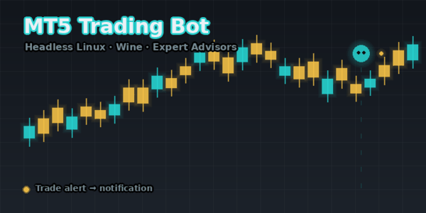

# 🤖 Panduan Lengkap Sistem Trading Otomatis MetaTrader 5 di Linux

[](LICENSE)
[](https://www.winehq.org/)
[](https://www.metatrader5.com/)
[](https://github.com)
[](https://github.com)



Dokumen ini menggabungkan seluruh materi panduan instalasi **platform MT5** dan panduan **EA (Expert Advisor) & Signal** ke dalam satu rujukan terstruktur. Isinya mencakup arsitektur sistem, setup langkah demi langkah, penjelasan tiap komponen, serta panduan maintenance (menjalankan, update, backup/restore, monitoring, troubleshooting, dan best practice).

> **Catatan Keamanan & Privasi:** Seluruh nilai bersifat rahasia (nomor akun, password, token, webhook, path user, domain) diganti dengan *placeholder* seperti `YOUR_...`. Ganti dengan nilai milik Anda sendiri saat implementasi. Jangan pernah menyimpan kredensial di dalam repositori.

---

## 📑 Daftar Isi

1. [Pendahuluan](#1-pendahuluan)
2. [Arsitektur Sistem](#2-arsitektur-sistem)
3. [Persiapan](#3-persiapan)
4. [Setup Langkah demi Langkah](#4-setup-langkah-demi-langkah)
5. [Penjelasan Expert Advisor (EA)](#5-penjelasan-expert-advisor-ea)
6. [Mengaktifkan Signal Trading](#6-mengaktifkan-signal-trading)
7. [Panduan Maintenance](#7-panduan-maintenance)
8. [Troubleshooting & Error Umum](#8-troubleshooting--error-umum)
9. [Best Practice (Performa & Keamanan)](#9-best-practice-performa--keamanan)
10. [Referensi](#10-referensi)

---

## 1. Pendahuluan

Sistem ini menjalankan **MetaTrader 5 (MT5)** secara headless (tanpa monitor) di atas **Linux** menggunakan **Wine** — sebuah lapisan kompatibilitas yang memungkinkan aplikasi Windows berjalan di Linux. Karena MT5 adalah aplikasi GUI, kita butuh **display virtual (Xvfb)** agar MT5 bisa berjalan tanpa kartu grafis sungguhan. EA (robot trading berbasis MQL5) dipasang ke chart untuk membuka/tutup posisi secara otomatis, dan sebuah **log watcher** mengirim notifikasi ke kanal chat saat ada transaksi.

**Mengapa pendekatan ini?**
- MT5 tidak memiliki versi Linux resmi → Wine adalah jembatan yang sudah terbukti.
- VPS (Virtual Private Server) biayanya murah dan bisa *24/7 uptime* → EA berjalan terus meski komputer lokal mati.
- Display virtual + VNC memungkinkan Anda melihat/ mengontrol MT5 dari jarak jauh bila perlu.

---

## 2. Arsitektur Sistem

```
┌──────────────────────────────────────────────────────────────────┐
│                      VPS (Ubuntu Linux)                           │
│                                                                    │
│   ┌────────────────┐        ┌──────────────────────────────────┐  │
│   │  systemd       │        │       Wine Prefix (~/.mt5)        │  │
│   │  mt5.service   │───────▶│                                  │  │
│   └────────────────┘        │   MetaTrader 5 (terminal64.exe) │  │
│          │                   │          │                       │  │
│          ▼                   │          ▼                       │  │
│   ┌────────────────┐        │   ┌──────────────────────────┐  │  │
│   │ Xvfb :99       │        │   │ EA (MQL5) per chart:     │  │  │
│   │ (virtual       │        │   │  • SMC_ICT_Master        │  │  │
│   │  display)      │        │   │  • ForexScalper          │  │  │
│   └────────────────┘        │   │  • GoldScalper           │  │  │
│          ▲                   │   └──────────────────────────┘  │  │
│          │                   └──────────────────────────────────┘  │
│   ┌────────────────┐                                              │
│   │ x11vnc / noVNC │◀──── Akses remote (VNC viewer / browser)    │
│   └────────────────┘                                              │
│                                                                    │
│   ┌────────────────┐        ┌──────────────────────────────────┐  │
│   │ Log Watcher    │───────▶│ Notifikasi (Discord / Telegram)  │  │
│   │ (cron / script)│        └──────────────────────────────────┘  │
│   └────────────────┘                                              │
└──────────────────────────────────────────────────────────────────┘
```

**Penjelasan tiap layer:**

| Layer | Komponen | Fungsi |
|-------|----------|--------|
| OS | Ubuntu 22.04+ (VPS) | Sistem operasi host |
| Display | **Xvfb** (`:99`) | Framebuffer virtual agar MT5 (GUI) bisa render tanpa monitor |
| Remote | **x11vnc** + **noVNC** | Akses visual MT5 dari jarak jauh (opsional, untuk debugging) |
| Runtime | **Wine Staging** (`~/.mt5`) | Jalankan `terminal64.exe` (MT5) & `MetaEditor64.exe` (compiler EA) |
| Aplikasi | **MetaTrader 5** | Platform trading, koneksi ke broker, eksekusi order |
| Logika | **EA (MQL5)** | Robot trading yang memutuskan kapan beli/jual di tiap chart |
| Lifecycle | **systemd `mt5.service`** | Pastikan MT5 auto-start & restart otomatis saat VPS reboot/crash |
| Observability | **Log Watcher** | Baca log MT5, kirim alert transaksi ke chat |
| Notifikasi | **Webhook** | Saluran (Discord/Telegram) tempat alert diterima |

**Alur data:**
1. `systemd` menyalakan Xvfb lalu menjalankan MT5 via Wine.
2. MT5 login ke broker, memuat chart, dan menjalankan EA yang terpasang.
3. EA membaca harga & indikator, lalu membuka/menutup posisi.
4. Setiap aksi dicatat ke log MQL5 (`Print("TRADE_OPEN: ...")`).
5. Log Watcher mendeteksi pola tertentu dan menembak webhook notifikasi.

---

## 3. Persiapan

### 3.1 Spesifikasi VPS Minimum

| Komponen | Minimal | Rekomendasi |
|----------|---------|-------------|
| CPU | 1 core | 2 core |
| RAM | 2 GB | 4 GB |
| Storage | 20 GB | 40 GB |
| OS | Ubuntu 22.04 | Ubuntu 24.04 |
| Akses | root / sudo user | sudo user |

> Pilih provider VPS mana pun (contoh: layanan cloud umum). Buka port yang diperlukan (5900 untuk VNC, 6080 untuk noVNC) di **firewall provider**, bukan hanya `iptables`, karena banyak VPS menggunakan firewall level network.

### 3.2 Yang Dibutuhkan

- Akun MT5 (Demo atau Real) dari broker Anda — simpan **nomor akun, password, dan nama server** di tempat aman (password manager), **jangan** ditulis di repo.
- File EA (`.ex5` hasil compile, atau `.mq5` source).
- Akses sudo di VPS.

### 3.3 Variabel Placeholder

Ganti nilai berikut sesuai milik Anda di sepanjang dokumen:

| Placeholder | Arti |
|-------------|------|
| `YOUR_USER` | Username Linux Anda (mis. `ubuntu`, `deploy`) |
| `YOUR_BROKER_SERVER` | Nama server broker (mis. `YourBroker-Demo2`) |
| `YOUR_ACCOUNT_NUMBER` | Nomor login akun MT5 (contoh format `1100XXXXXX`) |
| `YOUR_BROKER_PASSWORD` | Password akun MT5 |
| `YOUR_DISCORD_WEBHOOK_URL` | URL webhook notifikasi |
| `YOUR_VPS_IP` | IP publik VPS |

---

## 4. Setup Langkah demi Langkah

### Step 1 — Install Wine Staging

Wine menjembatani MT5 (Windows) di Linux. **Staging** adalah build dengan patch terbaru yang paling kompatibel untuk MT5.

```bash
# Tambah arsitektur i386 (MT5 butuh lib 32-bit)
sudo dpkg --add-architecture i386

# Impor GPG key WineHQ (pakai pipe agar tidak error /dev/tty)
sudo mkdir -pm755 /etc/apt/keyrings
wget -qO - https://dl.winehq.org/wine-builds/winehq.key | gpg --dearmor | sudo tee /etc/apt/keyrings/winehq-archive.key > /dev/null 2>&1

# Tambah repo WineHQ (sesuaikan "noble" dengan versi Ubuntu: jammy=22.04, noble=24.04)
sudo wget -NP /etc/apt/sources.list.d/ https://dl.winehq.org/wine-builds/ubuntu/dists/noble/winehq-noble.sources

# Install
sudo apt update
sudo apt install -y --install-recommends winehq-staging
```

**Verifikasi:**
```bash
wine --version
```
> ⚠️ **Pitfall:** Pemanggilan `wine --version` pertama akan menginisialisasi prefix `~/.wine` dan bisa makan waktu 30+ detik. Jangan di-timeout prematur.

---

### Step 2 — Install Virtual Display + VNC

```bash
sudo apt install -y xvfb x11vnc xdotool scrot novnc websockify
```

**Jalankan Xvfb (display virtual):**
```bash
Xvfb :99 -screen 0 1024x768x24 &
export DISPLAY=:99
```

**Jalankan VNC server (untuk akses visual):**
```bash
# DISARANKAN: dengan password (simpan di file aman, mis. ~/.hermes/.vncpass)
x11vnc -storepasswd YOUR_VNC_PASSWORD ~/.hermes/.vncpass
x11vnc -display :99 -rfbauth ~/.hermes/.vncpass -rfbport 5900 -forever -shared &

# TIDAK disarankan di produksi: tanpa password (hanya jika terisolasi total)
# x11vnc -display :99 -rfbport 5900 -forever -shared -nopw &
```

**Jalankan noVNC (akses via browser):**
```bash
websockify --web /usr/share/novnc/ 6080 localhost:5900 &
```
Buka `http://YOUR_VPS_IP:6080/vnc.html`.

> ⚠️ **Pitfall:** Buka port 5900 & 6080 di firewall **provider** (bukan cuma `iptables`).

---

### Step 3 — Install WebView2 (Dependency MT5)

MT5 membutuhkan Microsoft Edge WebView2 untuk komponen web-nya.

```bash
cd /tmp
curl -sL "https://msedge.sf.dl.delivery.mp.microsoft.com/filestreamingservice/files/REPLACE_WITH_WEBVIEW2_URL/MicrosoftEdgeWebview2Setup.exe" -o webview2.exe

WINEPREFIX=~/.mt5 winecfg -v=win11
WINEPREFIX=~/.mt5 wine webview2.exe /silent /install
```

---

### Step 4 — Download & Install MetaTrader 5

```bash
cd /tmp
# Installer umum
curl -sL "https://download.mql5.com/cdn/web/metaquotes.software.corp/mt5/mt5setup.exe" -o mt5setup.exe
# ATAU installer broker (sudah terisi server broker) — ganti URL sesuai broker Anda
# curl -sL "https://download.terminal.free/cdn/web/YOUR_BROKER/mt5/yourbroker5setup.exe" -o mt5setup.exe
```

**Jalankan installer:**
```bash
export DISPLAY=:99
WINEPREFIX=~/.mt5 wine /tmp/mt5setup.exe &

# Installer MT5 adalah GUI kustom — tidak ada flag silent.
# Tunggu jendela, lalu tekan Enter untuk melewati wizard.
sleep 60
xdotool key Return
sleep 10
```

**Verifikasi:**
```bash
ls ~/.mt5/drive_c/Program\ Files/MetaTrader\ 5/terminal64.exe
```
> ⚠️ **Pitfall:** Installer butuh otomasi keyboard (Enter) lewat 3–4 layar wizard. Jika gagal, gunakan noVNC untuk klik manual.

---

### Step 5 — Jalankan MT5

```bash
export DISPLAY=:99
WINEPREFIX=~/.mt5 wine ~/.mt5/drive_c/Program\ Files/MetaTrader\ 5/terminal64.exe &

# Verifikasi MT5 berjalan
xdotool search --name "MetaTrader" getwindowname
```

---

### Step 6 — Login ke Akun Broker

Lewat VNC/noVNC:
1. **File → Login to Trade Account**
2. Isi:
   - Login: `YOUR_ACCOUNT_NUMBER`
   - Password: `YOUR_BROKER_PASSWORD`
   - Server: `YOUR_BROKER_SERVER`
3. Klik **OK**

**Verifikasi koneksi** (baca log terminal):
```bash
cat ~/.mt5/drive_c/Program\ Files/MetaTrader\ 5/logs/$(date +%Y%m%d).log | tr -d '\0' | grep -i 'authorized\|connected\|failed'
```
Harapan: `authorized on YOUR_BROKER_SERVER`

---

### Step 7 — Install Expert Advisor (EA)

#### 7a. Copy file EA + indikator prasyarat

Beberapa EA butuh **indikator custom** terpasang dulu (selain EA itu sendiri):
- **SMC_ICT_Master** membutuhkan `PivotSuperTrend.ex5` dan `MarketStructure_SMC.ex5` di folder `Indicators/`.
- **ForexScalper / GoldScalper** membutuhkan indikator bawaan MT5 (Super Trend, MACD) — tidak perlu install tambahan.

Letakkan indikator custom ke:
```bash
INDIR="$HOME/.mt5/drive_c/Program Files/MetaTrader 5/MQL5/Indicators"
cp PivotSuperTrend.ex5 MarketStructure_SMC.ex5 "$INDIR/"
```

Lalu copy EA:
```bash
EADIR="$HOME/.mt5/drive_c/Program Files/MetaTrader 5/MQL5/Experts"
cp SMC_ICT_Master.mq5 "$EADIR/"
cp ForexScalper.mq5   "$EADIR/"
cp GoldScalper.mq5    "$EADIR/"
```

#### 7b. Compile EA
Compiler butuh `DISPLAY=:99` (walaupun CLI).
```bash
export DISPLAY=:99
export WINEPREFIX=~/.mt5
cd "$HOME/.mt5/drive_c/Program Files/MetaTrader 5"

wine MetaEditor64.exe /compile:"MQL5/Experts/SMC_ICT_Master.mq5"
wine MetaEditor64.exe /compile:"MQL5/Experts/ForexScalper.mq5"
wine MetaEditor64.exe /compile:"MQL5/Experts/GoldScalper.mq5"
```
**Verifikasi:**
```bash
ls -la "$EADIR"/*.ex5
```
> ⚠️ **Pitfall:** MetaEditor64 butuh `DISPLAY=:99` meski compile via CLI. Xvfb harus hidup.

#### 7c. Restart MT5 agar EA baru termuat
```bash
pkill -f msedgewebview2.exe; sleep 1
pkill -f terminal64.exe; sleep 4
pkill -9 wineserver 2>/dev/null; pkill -9 winedevice 2>/dev/null; sleep 2

export DISPLAY=:99
WINEPREFIX=~/.mt5 wine ~/.mt5/drive_c/Program\ Files/MetaTrader\ 5/terminal64.exe &
```

#### 7d. Pasang EA ke chart (via VNC)
1. **File → New Chart → Forex → EURUSD**
2. Timeframe **M5** (Ctrl+5)
3. Buka **Navigator** (Ctrl+N)
4. Cari EA di bawah **Expert Advisors**
5. Double-click → atur input → **OK**
6. Pastikan tombol **Auto Trading** hijau (Ctrl+E)
7. Cek ikon 🤖 muncul di chart
8. Ulangi untuk pasangan lain

---

### Step 8 — Konfigurasi EA

#### SMC_ICT_Master (EURUSD / GBPUSD / USDJPY / XAUUSD)

| Parameter | Nilai Contoh | Keterangan |
|-----------|--------------|------------|
| Magic Number | `300000` | ID unik, hindari tabrakan antar EA |
| Timeframe | M5 | Foundational TF untuk entry |
| MaxTrades | `1` | Maksimal posisi terbuka bersamaan |
| Cooldown | `600` (detik) | Jeda antar trade |
| Risk per trade | `1%` | Persentase ekuitas per posisi |
| HTF Filter | H1 | Arah tren dari kerangka waktu lebih tinggi |

#### ForexScalper (EURUSD / USDJPY / GBPUSD)

| Parameter | Nilai Contoh |
|-----------|--------------|
| Magic Number | `100001` |
| Timeframe | M5 |
| SL | 15 pips |
| RR Ratio | 1:1.5 |
| Risk | 1% per trade |
| Indikator | Super Trend + MACD |
| Max positions | 1 per pair |

#### GoldScalper (XAUUSD)

| Parameter | Nilai Contoh |
|-----------|--------------|
| Magic Number | `200001` |
| Timeframe | M5 |
| SL | 30 pips |
| RR Ratio | 1:2.0 |
| Risk | 0.5% per trade |
| Indikator | Super Trend + MACD + Momentum filter |
| Cool-down | Setelah 3 loss berturut-turut |
| Max positions | 1 per pair |

> **Prinsip penting:** 1 pasangan = 1 entry maksimum. Selalu cek `CountPositions() > 0` sebelum buka posisi baru agar tidak duplikat.

---

### Step 9 — Auto-Start dengan systemd

Buat script start:
```bash
mkdir -p ~/.hermes/scripts ~/.hermes/logs
```

**`~/.hermes/scripts/mt5-start.sh`:**
```bash
#!/bin/bash
# MetaTrader 5 auto-start script
# Starts terminal64.exe under an existing/reusable Xvfb display.
#
# PENTING: Xvfb dan x11vnc dianggap PERSISTENT — TIDAK dibunuh saat exit.
# Mematikan Xvfb saat MT5 sedang jalan memutus koneksi X MT5 dan memicu
# crash loop. Hanya MT5 + wineserver yang dibersihkan saat exit.

export DISPLAY=:99
export WINEPREFIX=$HOME/.mt5
MT5_EXE="$WINEPREFIX/drive_c/Program Files/MetaTrader 5/terminal64.exe"
LOGFILE=$HOME/.hermes/logs/mt5.log
mkdir -p "$(dirname "$LOGFILE")"

# --- Cleanup: HANYA MT5 + wineserver. JANGAN kill Xvfb. ---
cleanup() {
    echo "[$(date)] Stopping MT5 (Xvfb dibiarkan nyala)..." >> "$LOGFILE"
    pkill -f "terminal64.exe" 2>/dev/null || true
    wineserver -k 2>/dev/null || true
}
trap cleanup EXIT

# --- Pastikan Xvfb nyala (reuse kalau sudah jalan, start kalau belum) ---
if ! pgrep -f "Xvfb :99" >/dev/null 2>&1; then
    echo "[$(date)] Starting Xvfb..." >> "$LOGFILE"
    Xvfb :99 -screen 0 1024x768x24 -ac -nolisten tcp &>/dev/null &
    sleep 2
else
    echo "[$(date)] Xvfb sudah nyala, reuse" >> "$LOGFILE"
fi

# --- Pastikan x11vnc nyala (password protected) ---
if ! pgrep -f "x11vnc" >/dev/null 2>&1; then
    echo "[$(date)] Starting x11vnc (password protected)..." >> "$LOGFILE"
    x11vnc -display :99 -rfbport 5900 -forever -shared -rfbauth $HOME/.hermes/.vncpass &>/dev/null &
    sleep 1
fi

# --- Bunuh MT5 instance lama (bukan Xvfb) agar start bersih ---
pkill -f "terminal64.exe" 2>/dev/null || true
wineserver -k 2>/dev/null || true
sleep 2

# --- Start MT5 ---
echo "[$(date)] Starting MetaTrader 5..." >> "$LOGFILE"
wine "$MT5_EXE" >> "$LOGFILE" 2>&1 &
MT5_PID=$!; sleep 3
if kill -0 $MT5_PID 2>/dev/null; then
    echo "[$(date)] MT5 started (PID: $MT5_PID)" >> "$LOGFILE"
else
    echo "[$(date)] FAILED to start" >> "$LOGFILE"; exit 1
fi

# --- Coba enable Algo Trading (Ctrl+E) best-effort ---
# CATATAN: xdotool Ctrl+E tidak reliable di wine headless.
# Guard auto-trading juga ditangani oleh watchdog terpisah (restart-on-off).
sleep 15
WIN=$(xdotool search --class "terminal64.exe" 2>/dev/null | head -1)
if [ -n "$WIN" ]; then
    xdotool windowactivate --sync "$WIN" 2>/dev/null
    xdotool key --delay 100 "ctrl+e" 2>/dev/null
    echo "[$(date)] Sent Ctrl+E to enable Algo Trading" >> "$LOGFILE"
fi

wait $MT5_PID
```
```bash
chmod +x ~/.hermes/scripts/mt5-start.sh
```

**`/etc/systemd/system/mt5.service`:**
```ini
[Unit]
Description=MetaTrader 5 on Wine + Xvfb
After=network.target

[Service]
Type=simple
User=YOUR_USER
Group=YOUR_USER
Environment=DISPLAY=:99
Environment=WINEPREFIX=/home/YOUR_USER/.mt5
ExecStart=/home/YOUR_USER/.hermes/scripts/mt5-start.sh
Restart=on-failure
RestartSec=10
TimeoutStartSec=60

[Install]
WantedBy=multi-user.target
```
```bash
sudo systemctl daemon-reload
sudo systemctl enable mt5.service
```
> ⚠️ **Pitfall:** Jika MT5 sudah jalan manual, jangan `systemctl start` (akan konflik). Cukup `enable` — service akan auto-start saat reboot berikutnya.

---

### Step 10 — Notifikasi Trade (Discord/Telegram)

EA menulis `Print("TRADE_OPEN: BUY EURUSD @ ...")` ke log MQL5:
```
~/.mt5/drive_c/Program Files/MetaTrader 5/MQL5/logs/YYYYMMDD.log
```

**Log watcher (cron) contoh:**
```bash
# /home/YOUR_USER/.hermes/scripts/mt5-alert.sh
LOG=~/.mt5/drive_c/Program\ Files/MetaTrader\ 5/MQL5/logs/$(date +%Y%m%d).log
TAIL=$(tail -n 20 "$LOG" | tr -d '\0' | grep 'TRADE_OPEN' | tail -n 1)
if [ -n "$TAIL" ] && ! grep -q "$TAIL" ~/.hermes/logs/alerted.txt 2>/dev/null; then
  curl -s -X POST YOUR_DISCORD_WEBHOOK_URL \
    -H "Content-Type: application/json" \
    -d "{\"content\":\"$TAIL\"}"
  echo "$TAIL" >> ~/.hermes/logs/alerted.txt
fi
```
Jadwalkan via cron setiap menit:
```bash
* * * * * /home/YOUR_USER/.hermes/scripts/mt5-alert.sh
```

---

## 5. Penjelasan Expert Advisor (EA)

EA adalah program MQL5 yang berjalan di dalam MT5 dan mengotomatisasi keputusan trading.

- **SMC_ICT_Master** — Menggunakan konsep *Smart Money Concepts / ICT*: mendeteksi struktur pasar (HH/HL/LH/LL), zone likuiditas, dan *order block*. Cocok untuk multi-pair (EURUSD, GBPUSD, USDJPY, XAUUSD). Memiliki filter arah dari *Higher Timeframe* (H1) sebagai fallback.
- **ForexScalper** — Scalping pada EURUSD/USDJPY/GBPUSD di M5 dengan filter Super Trend + MACD. Risk 1%, RR 1:1.5.
- **GoldScalper** — Khusus XAUUSD (emas), SL lebih lebar (30 pips) karena volatilitas emas, RR 1:2, plus *cooldown* setelah 3 loss beruntun.

**Cara kerja umum EA:**
1. `OnTick()` dipanggil setiap perubahan harga.
2. EA mengecek filter (sesi, spread, arah HTF, ADR).
3. Jika sinyal valid & belum ada posisi (`CountPositions()==0`), buka order via `trade.Buy()/Sell()`.
4. Pasang SL/TP (berbasis pip, bukan ATR — lihat pitfall).
5. Catat aksi ke log untuk notifikasi.

---

## 6. Mengaktifkan Signal Trading

Selain EA, Anda bisa meniru trader lain via fitur **Signals** MT5.

1. **Tools → Options → Signals**, centang *"Enable signals for automated trading"*.
2. Buka tab **Signals**, cari provider di [mql5.com/signals](https://www.mql5.com/en/signals).
3. Klik **Subscribe** → bayar (jika berbayar) → tunggu approval.
4. Pastikan **AutoTrading** ON (tombol hijau) dan *Allow automated trading* aktif.

**Verifikasi di Journal tab:**
```
→ Signal: connected to server
→ Signal: synchronization OK
```
> ⚠️ Signal menyalin trading orang lain — risiko sepenuhnya pada subscriber. EA (robot sendiri) umumnya lebih transparan & bisa dikontrol.

---

## 7. Panduan Maintenance

### 7.1 Menjalankan Sistem

**Mulai (jika belum via systemd):**
```bash
sudo systemctl start mt5.service
```

**Cek status:**
```bash
sudo systemctl status mt5.service
journalctl -u mt5.service -f        # tail log real-time
```

**Hentikan:**
```bash
sudo systemctl stop mt5.service
```

**Restart (mis. setelah ganti EA/input):**
```bash
sudo systemctl restart mt5.service
```

**Cek proses Wine/MT5 hidup:**
```bash
ps aux | grep -E 'terminal64|Xvfb|x11vnc' | grep -v grep
```

---

### 7.2 Melakukan Update

**A. Update source EA & recompile:**
```bash
# 1. Edit file .mq5 (atau upload versi baru)
nano "$HOME/.mt5/drive_c/Program Files/MetaTrader 5/MQL5/Experts/SMC_ICT_Master.mq5"

# 2. Compile ulang
export DISPLAY=:99 WINEPREFIX=~/.mt5
cd "$HOME/.mt5/drive_c/Program Files/MetaTrader 5"
wine MetaEditor64.exe /compile:"MQL5/Experts/SMC_ICT_Master.mq5" /log:"MQL5/Experts/compile.log"

# 3. Cek hasil compile
cat "MQL5/Experts/compile.log" | tr -d '\0' | tail -n 20

# 4. MT5 TIDAK auto-reload .ex5 -> restart terminal agar EA baru termuat
sudo systemctl restart mt5.service
```

**B. Update MT5 (via in-app):** Buka MT5 → menu **Help → About → Check for Updates**, atau jalankan installer terbaru. Lakukan saat pasar sepi / EA tidak ada posi terbuka.

**C. Update Wine:** `sudo apt update && sudo apt upgrade winehq-staging`. Test setelah upgrade — kadang build baru mengubah perilaku display.

> **Catatan:** Mengubah *input parameter* EA via UI MT5 tidak butuh restart terminal, cukup *reload* EA di chart (drag ulang / centang ulang AutoTrading). Tapi mengganti *binary .ex5* WAJIB restart terminal.

---

### 7.3 Backup & Restore

**Apa yang di-backup:**
| Item | Path |
|------|------|
| EA source & compiled | `~/.mt5/drive_c/Program Files/MetaTrader 5/MQL5/Experts/` |
| Indikator custom | `.../MQL5/Indicators/` |
| Profile chart & template | `.../MQL5/Profiles/`, `.../MQL5/Templates/` |
| Config & server | `.../config/`, `.../MQL5/Files/` (termasuk file state EA) |
| Log penting | `.../logs/`, `.../MQL5/logs/` |
| Start script | `~/.hermes/scripts/mt5-start.sh` |
| systemd unit | `/etc/systemd/system/mt5.service` |

**Backup (tar + rsync ke lokasi aman):**
```bash
# Buat snapshot lengkap prefix MT5
tar -czf mt5-backup-$(date +%F).tar.gz \
  -C ~/.mt5/drive_c/Program\ Files/ "MetaTrader 5/MQL5" \
  -C ~/.mt5/drive_c/Program\ Files/ "MetaTrader 5/config" \
  ~/.hermes/scripts/mt5-start.sh

# ATAU rsync ke VPS/Storage lain (ganti path tujuan)
rsync -avz ~/.mt5/drive_c/Program\ Files/MetaTrader\ 5/MQL5 /backup/mt5/
```
Simpan backup di **lokasi terpisah** (object storage / VPS lain), bukan di VPS yang sama.

**Restore:**
```bash
# Hentikan MT5 dulu
sudo systemctl stop mt5.service

# Ekstrak ke lokasi asal
tar -xzf mt5-backup-YYYY-MM-DD.tar.gz -C ~/.mt5/drive_c/Program\ Files/

# Kembalikan script & service
cp mt5-start.sh ~/.hermes/scripts/
sudo cp mt5.service /etc/systemd/system/ && sudo systemctl daemon-reload

# Nyalakan kembali
sudo systemctl start mt5.service
```
> Jangan restore saat ada posisi terbuka. Lakukan di penutupan pasar.

---

### 7.4 Monitoring Log & Observability

**Log MT5 terminal (koneksi, error umum):**
```bash
cat ~/.mt5/drive_c/Program\ Files/MetaTrader\ 5/logs/$(date +%Y%m%d).log | tr -d '\0' | tail -n 50
```

**Log EA / MQL5 (print EA, trade open/close):**
```bash
cat ~/.mt5/drive_c/Program\ Files/MetaTrader\ 5/MQL5/logs/$(date +%Y%m%d).log | tr -d '\0' | grep -i 'TRADE_OPEN\|error\|invalid'
```

**Log systemd:**
```bash
journalctl -u mt5.service --since "1 hour ago"
```

**Cek koneksi broker & otorisasi:**
```bash
cat ~/.mt5/drive_c/Program\ Files/MetaTrader\ 5/logs/$(date +%Y%m%d).log | tr -d '\0' | grep -i 'authorized\|connected'
```

**Monitoring resource (cegah OOM):**
```bash
top -p $(pgrep -f terminal64.exe | head -1)
free -h
df -h /home/YOUR_USER
```

---

### 7.5 Menangani Error Umum

Lihat juga [Section 8](#8-troubleshooting--error-umum) untuk daftar lengkap. Alur umum:
1. Baca log (`tr -d '\0'` wajib — log MT5 ber-encoding UTF-16LE).
2. Identifikasi pola error (lihat tabel di bawah).
3. Terapkan fix, lalu **restart** MT5.
4. Verifikasi lewat log bahwa error hilang & `authorized` muncul.

| Gejala | Kemungkinan Penyebab | Tindakan |
|--------|----------------------|----------|
| EA tidak trade | Filter sesi pakai `TimeGMT()` (off UTC) | Ganti ke `TimeCurrent()` |
| `Invalid stops` | Min stop distance dilanggar | Normalisasi dengan `NormalizeDouble()` |
| EA dobel entry | Tidak ada cek `CountPositions()` | Tambah guard + cooldown |
| MT5 tidak reconnect | Restart: kill WebView2 + terminal + wineserver |
| MT5 crash loop saat restart | Jangan kill Xvfb saat MT5 jalan — putus koneksi X → crash. Biarkan Xvfb persistent |
| VNC layar hitam | `ps aux \| grep Xvfb`; nyalakan ulang |
| Port tak terakses | Firewall provider tutup | Buka di console provider |
| Log acak/ilang | Encoding UTF-16LE | `tr -d '\0'` atau `iconv -f UTF-16LE -t UTF-8` |
| `wine --version` hang | Init prefix pertama | Tunggu ~30s, jangan timeout |
| EA tak load setelah compile | MT5 load EA saat startup saja | Restart terminal |

---

### 7.6 Best Practice (Performa & Keamanan)

**Performa:**
- Batasi jumlah EA/chart agar RAM cukup (2 GB bisa untuk 1–2 pair; 4 GB untuk multi-pair).
- Resolusi Xvfb kecil (`1024x768`) cukup — jangan 1920x1080 kecuali butuh VNC sering.
- Restart MT5 berkala (mis. sekali seminggu via cron) untuk membersihkan leak memori Wine.
- Simpan log ke rotasi; jangan biarkan `MQL5/logs` tumbuh tak terbatas (backup lalu hapus mingguan).
- Hindari EA dengan *loop berat* di `OnTick()` — pindahkan ke `OnTimer()` bila bisa.

**Keamanan:**
- **Jangan** commit kredensial ke repo (akun, password, webhook, token). Gunakan secret manager / env var.
- VNC **wajib** pakai password (`-rfbauth`); jangan `-nopw` di produksi.
- Batasi akses port VNC (5900/6080) via firewall hanya ke IP Anda, atau tunnel lewat SSH (`ssh -L`).
- Repositori panduan ini **private** — jangan jadikan public karena berisi arsitektur sistem.
- Update sistem secara berkala (`sudo apt update && upgrade`) untuk patch keamanan.
- Gunakan user non-root (sudo) untuk menjalankan MT5; jangan root langsung.
- Webhook URL diperlakukan sebagai **rahasia** — rotate secara berkala.

---

## 8. Troubleshooting & Error Umum

### 8.1 Pitfall Wine (khusus MQL5 di Wine)

**1. `CSymbolInfo.Bid()` Return 0 di Wine**
```mql5
// ❌ BROKEN in Wine
double bid = symbolInfo.Bid();
// ✅ WORKS in Wine
double bid = SymbolInfoDouble(_Symbol, SYMBOL_BID);
```

**2. `CPositionInfo.SelectByIndex()` Gagal di Wine**
```mql5
// ❌ BROKEN — data stale/false
if(!positionInfo.SelectByIndex(i)) continue;
// ✅ WORKS — pakai fungsi global
ulong ticket = PositionGetTicket(i);
long magic = PositionGetInteger(POSITION_MAGIC);
```

**3. Pakai `TimeCurrent()`, bukan `TimeGMT()`**
```mql5
// ❌ SALAH — UTC, bergeser 6-7 jam
TimeGMT(dt);
// ✅ BENAR — waktu server broker
TimeCurrent(dt);
```

**4. SL Berbasis Pip (bukan ATR)**
```mql5
// ❌ ATR bisa hasilkan TP negatif
double sl = superTrendVal[1] + atrVal * 0.3;
// ✅ Pip-based — selalu terprediksi
double slDist = SL_Pips * _Point * 10;
double sl = NormalizeDouble(currentAsk - slDist, _Digits);
```

**5. Log UTF-16LE**
```bash
# ❌ Output acak
cat logfile.log
# ✅ Terbaca
cat logfile.log | tr -d '\0'
iconv -f UTF-16LE -t UTF-8 logfile.log
```

**6. 1 Pair = 1 Entry Maks**
```mql5
if(CountPositions() > 0) return;
```

### 8.2 Error Lain

| Issue | Fix |
|-------|-----|
| EA gak trade | Cek filter sesi pakai `TimeCurrent()`, bukan `TimeGMT()` |
| `Invalid stops` | Cek min stop distance, `NormalizeDouble()` |
| EA duplikat entry | Tambah `CountPositions()>0` + cooldown |
| MT5 tidak reconnect | Restart: kill WebView2 + terminal + wineserver |
| MT5 crash loop saat restart | Jangan kill Xvfb saat MT5 jalan — putus koneksi X → crash. Biarkan Xvfb persistent |
| VNC layar hitam | `ps aux \| grep Xvfb`; nyalakan ulang |
| Port tak akses | Buka di firewall provider |
| Log tak terbaca | Encoding UTF-16LE → `tr -d '\0'` / `iconv` |
| `wine --version` hang | Init prefix ~30s, jangan timeout |
| EA tak load setelah compile | Restart MT5 (load EA saat startup) |
| `COM error (Wine)` `err:ole:CoGetClassObject` | Normal di Wine — abaikan |
| EA tak muncul di Navigator | Refresh (F5) / pastikan file di `MQL5/Experts/` / restart MT5 |
| Compile error (MetaEditor) | Butuh display `DISPLAY=:99`; pastikan Xvfb hidup |
| ADR filter keburu tinggi | Turunkan `MaxPercentADR` (mis. 25 → 35) |
| Spread > limit | Naikkan `MaxSpread` |

---

## 9. Best Practice (Performa & Keamanan)

> Ringkasan terpusat agar mudah diingat:

**Performa**
- RAM cukup (2 GB = 1–2 pair; 4 GB = multi-pair).
- Xvfb resolusi kecil.
- Restart MT5 berkala (cron mingguan) untuk bersihkan memori.
- Rotasi & backup log mingguan.
- Hindari loop berat di `OnTick()`.

**Keamanan**
- Nol kredensial di repo → pakai env/secret manager.
- VNC wajib password + firewall pembatas IP / SSH tunnel.
- Repo panduan **private**.
- User non-root untuk MT5.
- Patch OS rutin.
- Rotate webhook URL berkala.

---

## 10. Referensi

- [MetaTrader 5 Official](https://www.metatrader5.com/)
- [WineHQ Staging](https://wiki.winehq.org/Wine-Staging)
- [MQL5 Documentation](https://www.mql5.com/en/docs)
- [MQL5 Signals](https://www.mql5.com/en/signals)

---

> **Lisensi:** MIT — bebas digunakan & dimodifikasi. Jangan menyertakan data sensitif (akun, kredensial, webhook) saat membagikan dokumen ini.
